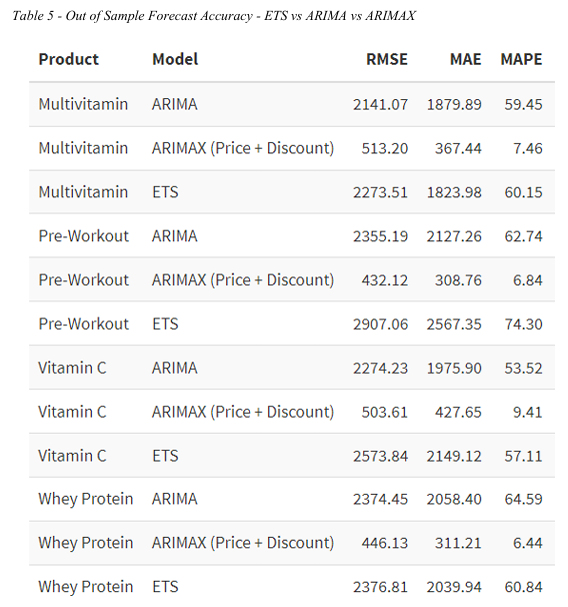
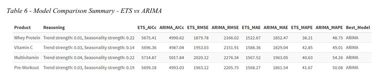

# 💊 Driver-Based Weekly Revenue Forecasting in E-Commerce Supplements

Time Series Models for Short-Term Commercial Planning

## 🔧 Tech Stack

Time Series Analysis · ETS · ARIMA · ARIMAX · STL Decomposition · Stationarity Tests · Forecast Evaluation · R

---

## Project Overview

### Problem

Accurate short-horizon revenue forecasting is important in e-commerce, where demand fluctuates and commercial levers such as price and discount change over time. When time series exhibit weak internal structure, relying only on historical values may not be sufficient.

---

### Approach

A comparative forecasting analysis was conducted for four products:

* Whey Protein
* Vitamin C
* Multivitamin
* Pre-Workout

Three model classes were evaluated:

* ETS
* ARIMA
* ARIMAX (with Price and Discount as exogenous drivers)

All models were evaluated using a **26-week holdout set**.

---

## 📊 Dataset

* Frequency: Weekly
* Period: 2020-01-06 to 2025-03-31
* Observations: 274 weeks

Variables include revenue, units sold, price, discount, location, platform, and product identifiers.

---

## 🔎 Exploratory Analysis

The four series show:

* No persistent trend
* Weak or unclear seasonality
* Limited autocorrelation

This suggests **low intrinsic time-series signal**.

---

## 🧠 Methodology

### Models

* ETS (decomposition-based)
* ARIMA (automatic order selection)
* ARIMAX (Price + Discount as drivers)

### Validation

* Train: all data except last 26 weeks
* Test: last 26 weeks
* Metrics: RMSE, MAE, MAPE

---

## 🏆 Results

### Out-of-Sample Forecast Accuracy



* ETS and ARIMA: high error (MAPE ≈ 53–74%)
* ARIMAX: strong improvement (MAPE ≈ 6–9%)

---

### Univariate Model Comparison



* ARIMA slightly better than ETS in-sample
* Both remain weak in forecasting performance

---

### Example Forecast (Whey Protein)


* ARIMAX closely tracks real values
* Captures short-term fluctuations significantly better

---

## 📌 Key Insights

* Weak trend and seasonality limit univariate models
* ETS and ARIMA revert toward averages
* ARIMAX captures variation using external drivers
* Revenue is better explained by **price and discount** than by past values alone

---

## 📊 Business Relevance

Driver-based forecasting enables:

* Pricing scenario analysis
* Promotion planning
* Inventory optimization
* More responsive short-term decisions

---

## 🚀 Possible Extensions

* Add more exogenous variables
* Include lagged effects
* Implement rolling forecasts
* Compare with ML models

---

## 📁 Repository Structure

```text
├── Supplement Sales Analysis.R
├── Images/
│   ├── table5.png
│   ├── table6.png
│   └── forecasting-whey-protein.png
└── README.md
```

---

## Conclusion

When time series lack strong internal structure, incorporating external drivers becomes essential.
ARIMAX consistently outperforms ETS and ARIMA, making it the most effective approach for short-term revenue forecasting in this context.